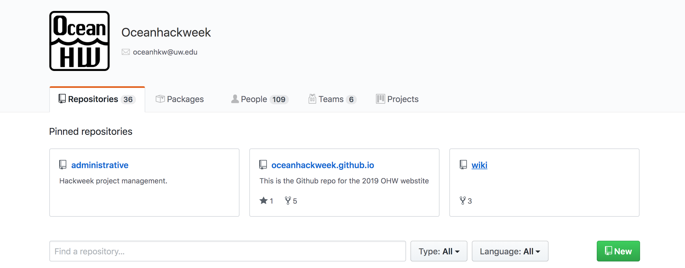
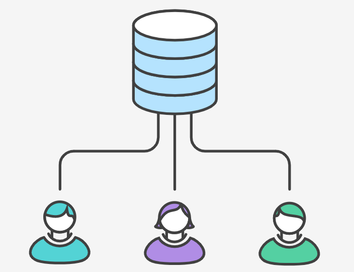
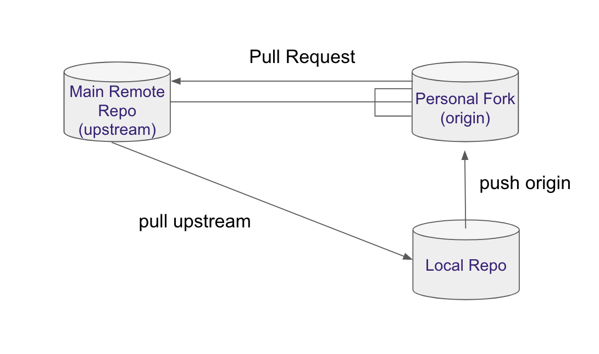

# git

## What is Git?

[Git](https://git-scm.com/) is a popular version control system that is the foundation of most open source software development. You are not required to know Git in advance of this event, but come prepared to learn a lot about it!

## What if I do not have the `git` command on my local machine?

If you don't have Git installed on you local machine, you can download the latest installer on [Git-SCM](https://git-scm.com). More help for the install process can be found in the [official Git documentation](https://git-scm.com/book/en/v2/Getting-Started-Installing-Git)

## How do I learn more?

We encourage you to start practicing with Git in advance of this event. Our tutorials will follow [this](https://berkeley-stat159-f17.github.io/stat159-f17/lectures/01-git/Git-Tutorial..html) lesson. Additional tutorial content from our past hackweeks is [here](https://geohackweek.github.io/Introductory/03-git-tutorial/). As always, feel free to post questions on


**CONTENT BELOW IS FROM VALENTINA, FOR OHW19. CURRENTLY JUST PASTED DIRECTLY, with minor edits that include removal of materials not focused on git or github.**

## 0. Prerequisites

- Set up git on your laptop and have your `github.com` account.
  - Installation instructions: [https://carpentries.github.io/workshop-template/#git](https://carpentries.github.io/workshop-template/#git)
  - Test set-up by typing `git` in the terminal (Git-Bash on Windows)
- Have joined the Oceanhackweek Github Organization.

## 1. Creating a project repository

One person in your group (preferably one who has never done it before) should volunteer and create a repository for the project under the Oceanhackweek organization. 

https://github.com/oceanhackweek



Click New and follow the steps: check yes to create README.md

* Format project name as `ohw19-project-ProjectName` (you can change the name later)
* Invite others to the repo:
	* Settings -> Collaborators
	* Note to collaborators: you will receive an invitation to your email associated with github.com. If you cannnot find it look for the `bell` notifications on the top right of the website.

## 2. Cloning the repository

Each participant should clone the repository so they have their local copy. Navigate through the terminal to the folder where you want to keep Oceanhackweek work. (`cd path_to_oceanhackweek`)

```
git clone www.github.com/oceanhackweek/ohw19-project-ProjectName 
```

This will create a new folder called `ohw19-project-ProjectName`. Navigate to the folder.

## 3. Updating the README with your name

Open the README.md file with your favorite editor create a section

Under this section add your name 

Then add this change, commit it to the local repository, and push it so that it appears on the github.com website.

```
git add README.md
git commit -m "Adding Valentina's name to README.md"
git push origin
```

Make sure your change appears online.

! Remember to run 

``` 
git status
```
to observe the changes made into the your repository.

Pay attention to the colors.

To see the changes in the files run:

```
git diff 

```

## 4. Updating your local repository with the changes of your collaborators

```
git pull origin master

```


! Remember `origin` is just a short name of the web address of the repository.

To see the what is hidden in origin:

```
git remote -v 

```

To practice these steps more, make more changes to the title and the description of the project.


*Ran into a problem?*

When working with several people sometimes you

* cannot push because changes have been made that have not been incorporated: need to first pull

* when pulling you arrive into a merge conflict: need to resolve the conflict manually


## 5. Resolving the merge conflict

```
git status
```


You will see the file/s which caused the merge conflict in green.

Open it and detect the conflict by the special format:

```
<<<<<<< HEAD
my text
=======
somebody else's text
>>>>>>> 35ab35436
```


Decide which changes you want to keep, and modify the file so it looks as you wish directly from the editor. Remove the unnecessary characters. Add, commit and push the changes.

```
git add README.md
git commit -m "resolving merge conflict"
git push origin master
```

You can continue working on as usual.


! Remember to pull often and push small changes to avoid messing with complicatd merges and keep your repo up-to-date.


## 6. Avoiding problems: forking workflow

So far you collaborated using what is called a centralized git workflow: i.e. every collaborator makes directly changes to the repo.



Some merge conflicts can be avoided by working with Forks instead of directly pushing to the repo.

Forks are public copies of the main repo, from which you can submit changes to the main repo.


* Sync your local repo with the public one
* Fork the public repo

	* Note it looks the same but the web address contains your username	
    [www.github.com/valentina-s/ohw19-project-ProjectName](www.github.com/valentina-s/ohw19-project-ProjectName)
* Go to your local repo and rename your `origin` to point to the fork:

```
git remote rm origin
git remote add origin www.github.com/valentina-s/ohw19-project-ProjectName
```

* Add a new remote to talk to the main repo:

```
git remote add upstream https://www.github.com/oceanhackweek/ohw19-project-ProjectName 
```

From now on you will push to `origin`, but you pull from `upstream`.


! Make sure your `origin` contains your github username, and upstream contains the oceanhackweek name.


### Submitting changes via a pull request

Make some changes to a file and commit and publish them.

```
git add README.md
git commit -m "more changes"
git push origin master
```

! Note they appear on your fork, but not on the main repo.

Submit a pull request by clicking `New pull request`:


* Explain what changes you have made.
* Assign somebody for review.

* Reviewer: look through changes in the files
* Approve PR or ask for more changes.

! Note: while your pull request is pending, any change you push to the fork will become a part of the request. This is useful if you are asked to make small changes before your PR is accepted.

In general we encourage github users to submit changes to the main repo through pull requests, but direct push is still a viable workflow for small projects when participants work on the same documents.




## Version control and Jupyter notebooks

* `git diff` gives rubbish on notebooks
	* notebooks are text files, but the information is stored in json format

* split analysis in small notebooks, individual people working on individual notebooks, put longer code into functions and keep move functions to modules (.py files which work well with version control). 

* before committing clear output notebook output
(images are stored in very long strings of crazy characters)

* if you use the jupyter lab mode you can work with `.py` files instead of notebooks
	```
	jupyter lab
	```

* nbdime: tool to diff notebooks [https://nbdime.readthedocs.io/en/latest/](https://nbdime.readthedocs.io/en/latest/)

## Troubleshooting

* Deleting files

	```
	git rm filename.txt	
	rm filename.txt
	```
	
	!  `git rm` just removes the file from git, to delete the file completely  use the bash `rm` command after that

* Reverting to the previous commit
	
	```
	git revert HEAD
	```
	
	! Note your files in the local repo will be still there. 

## References

- [Software Carpentry Lesson](http://swcarpentry.github.io/git-novice/)
- [Atlassian Tutorials - Version Control](https://www.atlassian.com/git/tutorials/what-is-version-control)
