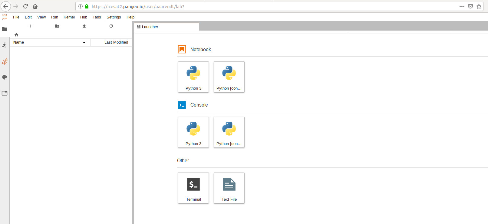
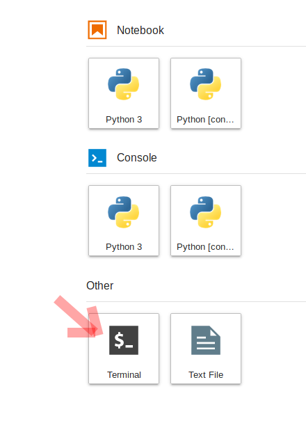
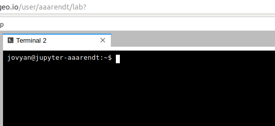
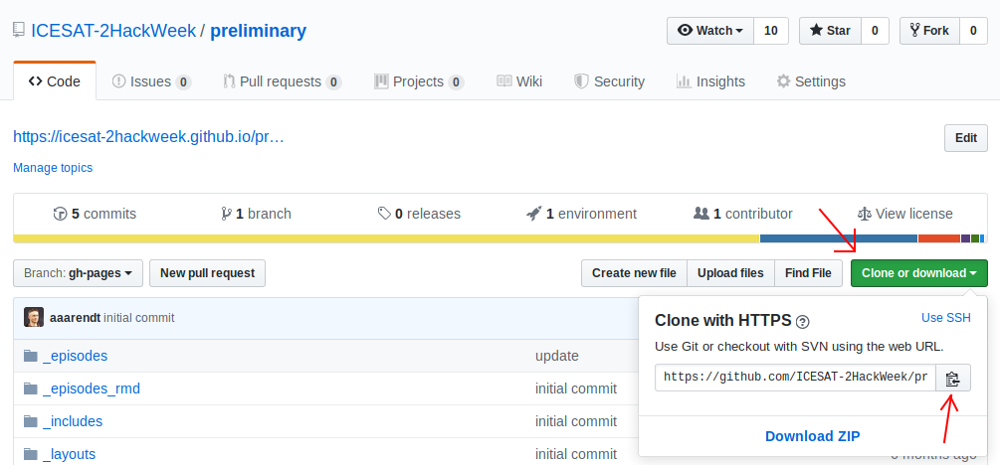

# JupyterHub

## Why are we using a shared cloud environment?

Teaching software to a diverse group of participants, each with different computers and operating systems, can be challenging. As you'll learn in the next lesson, there are specific ways to configure our software for the tutorials to be successful, so it takes time to get everyone set up consistently. Our solution to this is to give everyone access to a cloud computing environment that is pre-configured for the specific software we will deploy. This cloud computing instance can be accessed from any web browser, which eliminates the need for configuring each person's individual computer. For this hackweek we have created virtual computing instances on Amazon Web Services (AWS) that can be deployed on demand in a parallel computing environment. We use JupyterHub as a way to give a Jupyter Notebook server (JupyterLab) to each person in a group. [These (slightly old) slides](https://www.slideshare.net/willingc/jupyterhub-a-thing-explainer-overview?from_action=save) give a nice overview of what JupyterHub is all about. JupyterHub enables us to quickly begin working with code without spending time to get the necessary libraries and dependencies set up on everyone's individual computers.

We encourage you to use our shared Hub resources for running all the tutorials, and you can optionally use this for your projects as well. We also hope you will practice installing Python libraries locally on your laptop so that you can continue working after leaving our event.

!!! note "Pre-Hackweek Jupyter tutorial"
     **See the OHW20 pre-hackweek presentation on 8/7, [here](../tutorials/getting_started.md#pre-hackweek-tutorials), which demonstrated effective Jupyter use both locally and on the OHW Hub**

## How do I access the shared cloud environment?

Access to our shared cloud environment is easy. Just click on [{{ hackweek.jupyterhub_url }}]({{ hackweek.jupyterhub_url }})


Assuming you set up your GitHub credentials correctly (see the previous lesson), you can now click on the "Sign in with GitHub" button:


It will take a little bit of time for this to load - be patient! Once things are spun up you will see your very own instance of a [JupyterLab](https://jupyterlab.readthedocs.io/en/stable/) graphical user interface:




## How do I get my code in and out of the Hub?

When you start your own instance of the Hub you will have access to your own virtual drive space. No other Hub users will be able to see or access your data files. Next we will explain how you can upload files to your virtual drive space and how to save files from the Hub back to another location, such as GitHub or your own local laptop drive.

First we'll show you how to pull some files from GitHub into your virtual drive space.  This will be a common task during the hackweek: at the start of each tutorial we'll ask you to "clone" (make a copy of) the GitHub repository corresponding to the specific tutorial being taught into your Hub drive space.

To do this, we will need to interface with the file system of the Hub. Hub is deployed in a Linux operating system and we will need to open a terminal within the Hub JupyterLab interface to manage our files. There are two ways to do this: (1) Navigate to the "File" menu, choose "New" and then "Terminal" or (2) click on the "terminal" button in JupyterLab: 



This will open a new terminal tab in your JupyterLab interface:



Now you can issue any Linux commands to manage your local file system.

Now let's clone a repository (Note: we'll be teaching about Git clone during our introductory tutorials). This tutorial is built in a repository called "preliminary", so let's try cloning that. First, navigate in a browser on your own computer to the repository link [here](oceanhackweek/ohw20-tutorials). Next, click on the green "clone or download" button and then copy the url into your clipboard by clicking the copy button:

<!-- CREATE NEW SCREENSHOT USING OHW ORG -->


Now navigate back to your command line in JupyterLab. Type "git clone" and then paste in the url:

```bash
git clone https://github.com/oceanhackweek/ohw20-tutorials.git
```

!!! note "A note about cutting and pasting"
    Pasting something from your clipboard into the Pangeo terminal requires holding down the "shift" key and right-clicking.  This is different from the usual Linux method that only requires a right click.

After issuing the Git clone command you should see something like this:


## How do I end my Hub session? Will I lose all of my work?

When you are finished working for the day it is important to explicitly log out of your Hub session. The reason for this is it will save us a bit of money! When you keep a session active it uses up AWS resources and keeps a series of virtual machines deployed. 

**To log out and stop the server, select the menu item `File > Log Out`.**

!!! warning "logging out"
    Logging out will **NOT** cause any of your work to be lost or deleted. It simply shuts down some resources. It would be equivalent to turning off your desktop computer at the end of the day.


## References and Resources

- [Why Jupyter is data scientists’ computational notebook of choice. An improved architecture and enthusiastic user base are driving uptake of the open-source web tool (Nature, 2018-10)](https://www.nature.com/articles/d41586-018-07196-1)
- From [https://dataquest.io](https://dataquest.io)
    - [Jupyter Notebook for Beginners: A Tutorial](https://www.dataquest.io/blog/jupyter-notebook-tutorial/)
    - [Tutorial: Advanced Jupyter Notebooks](https://www.dataquest.io/blog/advanced-jupyter-notebooks-tutorial/)
    - [28 Jupyter Notebook Tips, Tricks, and Shortcuts](https://www.dataquest.io/blog/jupyter-notebook-tips-tricks-shortcuts/)
- [Getting Started with JupyterLab](https://www.blog.pythonlibrary.org/2019/02/05/getting-started-with-jupyterlab/)
- [Jupyter Lab: Evolution of the Jupyter Notebook. An overview of JupyterLab, the next generation of the Jupyter Notebook.](https://towardsdatascience.com/jupyter-lab-evolution-of-the-jupyter-notebook-5297cacde6b)